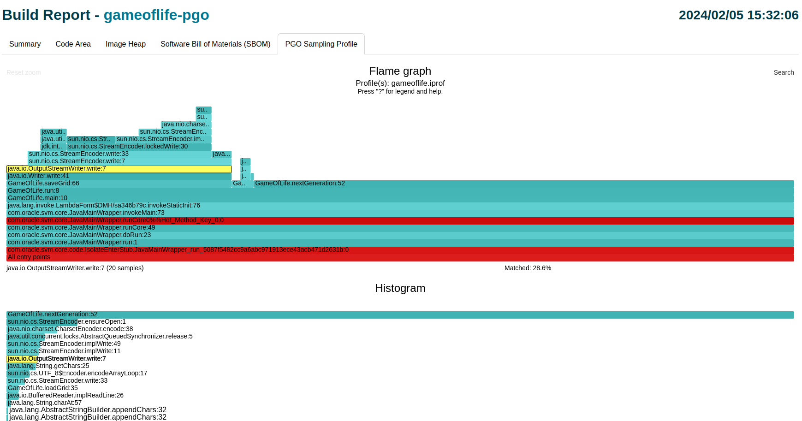

> *Note - Profile inspection assumes familiarity with fundamental PGO concepts and relies on example
application covered in basic usage. If not already familiar with these yet, we recommend first
reading [Profile Guided Optimization for Native Image](PGO.md) and [Basic Usage of Profile-Guided
Optimizations](PGO-Basic-Usage.md).*

# Inspecting Profiles in Build Report

* [Profile Visualization Generation](#profile-visualization-generation)
* [Profile Inspection using Build Report](#profile-inspection-using-build-report)

Profiles play an essential part in efficient AOT compilation by Native Image. They contain the information
about a particular execution of the application, and are used to guide the additional optimizations that
further improve application performance.
It is often useful to visualize the information in the profile.
This section explains how to inspect parts of the profile using the Build Report tool.

## Profile Visualization Generation

To generate a profile information about a particular application, one must first create an
instrumented image. After a successful compilation and execution, the binary will store the collected
information in an iprof file. This file represents the *profile* of that concrete execution and is
used for profile-guided optimization in a subsequent build.

Build Report is a tool for displaying various data about the image build. Among other things, Build
Report can be used for visualizing profiling information recorded by the sampler. The samples are
aggregated into a single flame graph. This is particularly useful for exploring how different methods
contribute to overall execution time.
Also, the graph is color-coded to show how the inliner made the inlining decisions during the compilation
(more on that in [the following section](#profile-inspection-using-build-report)).

To generate a report with the visualization for the Game-Of-Life example, we only have to pass the
additional `-H:+BuildReport` and `-H:+BuildReportSamplerFlamegraph` options to the optimized image
build:

``` bash
# Note - GRAALVM_HOME environment variable should point to a GraalVM installation.
$ $GRAALVM_HOME/bin/javac GameOfLife.java
$ $GRAALVM_HOME/bin/native-image -cp . GameOfLife -o gameoflife-instrumented --pgo-instrument
$ ./gameoflife-instrumented -XX:ProfilesDumpFile=gameoflife.iprof input.txt output.txt 10
$ $GRAALVM_HOME/bin/native-image -cp . GameOfLife -o gameoflife-pgo --pgo=gameoflife.iprof -H:+BuildReport -H:+BuildReportSamplerFlamegraph
```

> *Note - Refer to [Basic Usage of Profile-Guided Optimizations](PGO-Basic-Usage.md) for the full
step-by-step guide.*

## Profile Inspection using Build Report

The sampling profile information used in an optimized compilation in visualized in form of a flame
graph - a hierarchical chart that aggregates multiple stack traces. This flame graph is specialized
for differentiating hot vs. cold compilation units. There are three distinct colors (can also be seen
by showing legend with "?"):

- **Red** - used for marking root methods of hot compilation units,
- **Blue** - used for all the methods inlined into hot compilation root, and
- **Gray** - represents the "cold" code.

> *Note - The color descriptions and other useful information are part of chart legend (can be toggled
by clicking "?").*


The graph itself provides a couple of functionalities. First, a user can hover over the specific
method bar to see more information about that method such as number of samples and the percentage
related to total number of samples. Besides that, there is the ability to "zoom" into a particular
method (by clicking on it) to see all the subsequent calls in that call chain more clearly. One can
reset the view using *Reset Zoom* button in top-left corner.


Additionally, there is a search button (*Search*) located in top-right corner of the graph. It can be
used to highlight a specific method or group of methods that match the search criteria (the method(s)
will be colored yellow). Also, there is a *Matched* field that represents that group's share in the
total number of samples (showed underneath the chart in the right half). Note that this is also a
relative share - it will be readjusted when expanding/collapsing the view. There is also a *Reset
Search* button that can cancel the search at any time.


The flame graph also comes with the additional histogram (below it). It shows the individual methods'
contributions in the total execution time (descending by the number of samples). These bars are also
clickable, and the click has the same effect as searching - it highlights that particular method in
the flame graph above. Additional click on that same bar will reset the highlighting.


