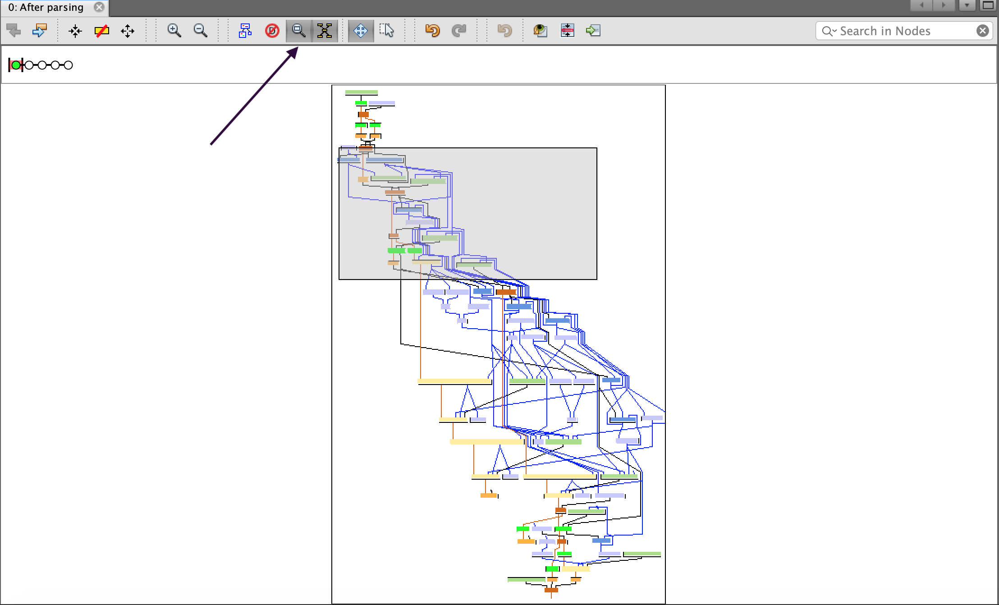

# Ideal Graph Visualizer

Ideal Graph Visualizer (IGV) is a developer tool allowing users to analyze compilation
graphs and investigate performance issues. The tool is essential for any
language implementers building on top of **Oracle GraalVM Enterprise Edition**. It is
available as a separate download on [Oracle Technology Network](https://www.oracle.com/technetwork/oracle-labs/program-languages/downloads/index.html) and requires accepting the Oracle Technology Network Developer License.

IGV is developed to view and inspect intermediate representation graphs -- a language-independent intermediate representation (IR) between the source
language and the machine code, generated by the compiler. See [Dumping Graphs](/en/graalvm/enterprise/{{ site.version }}/docs/tools/igv/#dumping-graphs) below.

1. Unzip the downloaded package and enter `bin` directory:
```shell
cd idealgraphvisualizer/bin
```

2. Launch the tool:
```shell
idealgraphvisualizer
```

3. Save the following code snippet as `Test.rb`:
```shell
require 'json'
obj = {
  time: Time.now,
  msg: 'Hello World',
  payload: (1..10).to_a
}
encoded = JSON.dump(obj)
js_obj = Polyglot.eval('js', 'JSON.parse').call(encoded)
puts js_obj[:time]
puts js_obj[:msg]
puts js_obj[:payload].join(' ')
```

4. From another console window, make sure the `ruby` runtime is available in GraalVM Enterprise,
and connect the `Test.rb` script to the running IGV:
```shell
gu list
ruby --jvm --polyglot --vm.Dgraal.Dump=:1 --vm.Dgraal.PrintGraph=Network Test.rb
```
This causes GraalVM Enterprise to dump compiler graphs in the IGV format over the network to an IGV process listening on `127.0.0.1:4445`. Once the connection is made, you are able to see the graphs in the Outline window.
Find, e.g., the `java.lang.String.char(int)` folder and open its After Parsing graph by double-clicking.
If the node has `sourceNodePosition` property, then the Processing window will attempt to display its location and the entire stacktrace.

## Browsing Graphs

Once a specific graph is opened, you can search for nodes by name, ID, or by `property=value` data, and all matching results will be shown.
Another great feature of this tool is the ability to navigate to the original guest language source code.
Select a node in the graph and press the Go to Source button in the Stack View window.


Graphs navigation is also available from the Context menu, enabled by focusing
and right-clicking a specific graph node. The Extract Nodes option will re-render
a graph and display only the selected nodes and their neighbors.


If the graph is larger than the screen, manipulate with the Satellite view button
in the main toolbar to move the viewport rectangle.



For user preference, the graph color scheme is adjustable by editing
the Coloring filter, enabled by default in the left sidebar.

## Viewing Source Code

Source code views can be opened in manual and assisted modes. Once you select a node
in the graph view, the Processing view will open. If the IGV knows where the source code
for the current frame is, the green Go to Source arrow is enabled. If the IGV does not
know where the source is, the line is greyed out and a Looking Glass button appears.


Press it and select Locate in Java project to locate the correct project in the dialog.
The IGV hides projects which do not contain the required source file.
The Source Collections serves to display the stand alone roots added by "Add root of sources" general action.
If the source is located using the preferred method (i.e., from a Java project),
its project can be later managed on the Project tab. That one is initially hidden,
but you can display the list of opened projects using Window -> Projects.

## Dumping Graphs

The IGV tool is developed to allow GraalVM Enterprise language implementers
to optimize their languages assembled with the [Language Implentation Framework](/en/graalvm/enterprise/{{ site.version }}/docs/graalvm-as-a-platform/language-implementation-framework/). As a development
tool it should not be installed to production environments.

To dump the GraalVM compiler graphs from an embedded Java application to the IGV,
you need to add options to GraalVM-based processes. Depending on the language/VM
used, you may need to prefix the options by `--vm`. See the particular
language's documentation for the details. The main option to add is
`-Dgraal.Dump=:1`. This will dump graphs in an IGV readable format to the local
file system. To send the dumps directly to the IGV over the network, add
`-Dgraal.PrintGraph=Network` when starting a GraalVM instance. Optionally a
port can be specified. Then dumps are sent to the IGV from the running GraalVM on
localhost. If the IGV does not listen on localhost, Options -> Ideal Graph Settings|
Accept Data From Network can be checked. If there is not an IGV instance
listening on `127.0.0.1` or it cannot be connected to, the dumps will be
redirected to the local file system. The file system location is `graal_dumps/`
under the current working directory of the process and can be changed with the
`-Dgraal.DumpPath` option.

In case an older GraalVM Enterprise is used, you may need to explicitly request that dumps
include the `nodeSourcePosition` property. This is done by adding the
`-XX:+UnlockDiagnosticVMOptions -XX:+DebugNonSafepoints` options.
